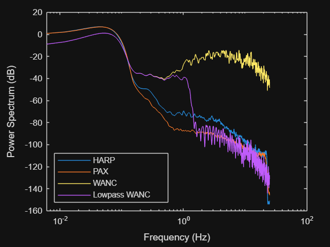
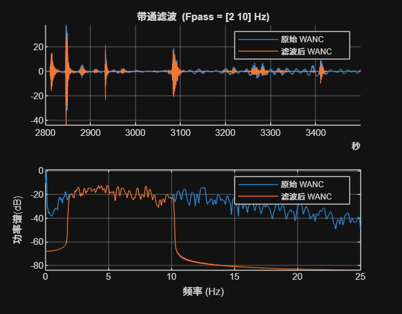
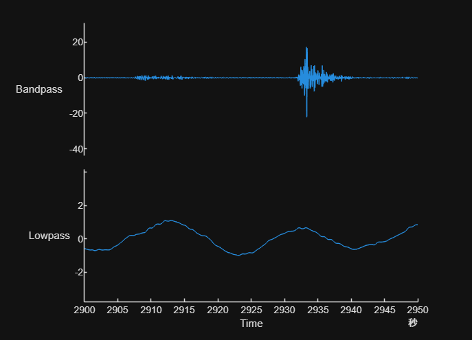
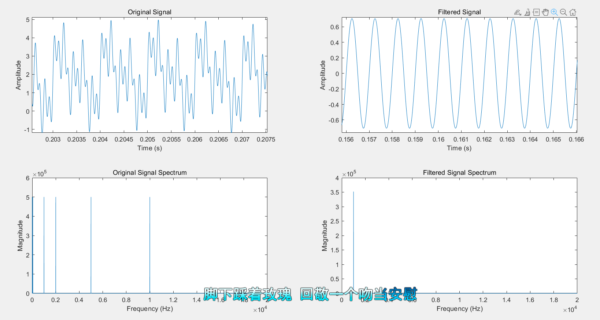

### **带通滤波器**

#### **主要函数**
```python
bandpass(tal, [f1, f2])
```
- **参数说明**:
  - `tal`: 时间序列数据（时间表），不是向量
  - `[f1, f2]`: 频率的上下限，`f1` 为下限频率，`f2` 为上限频率。

#### **信号处理效果展示**
1. **原始信号**  
   

2. **带通滤波后信号**  
   

3. **低通滤波后信号**  
   


---

### **说明**
- **带通滤波器**的作用是保留频率在 `[f1, f2]` 范围内的信号，滤除其他频率成分。
- **低通滤波器**的作用是保留频率低于 `f2` 的信号，滤除高频成分。

### *32平台上行MATLAB仿真验证*
